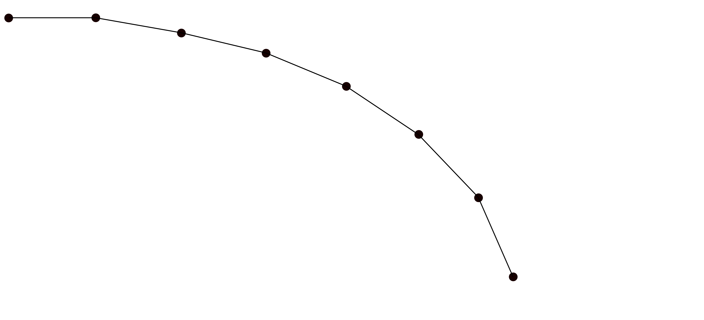
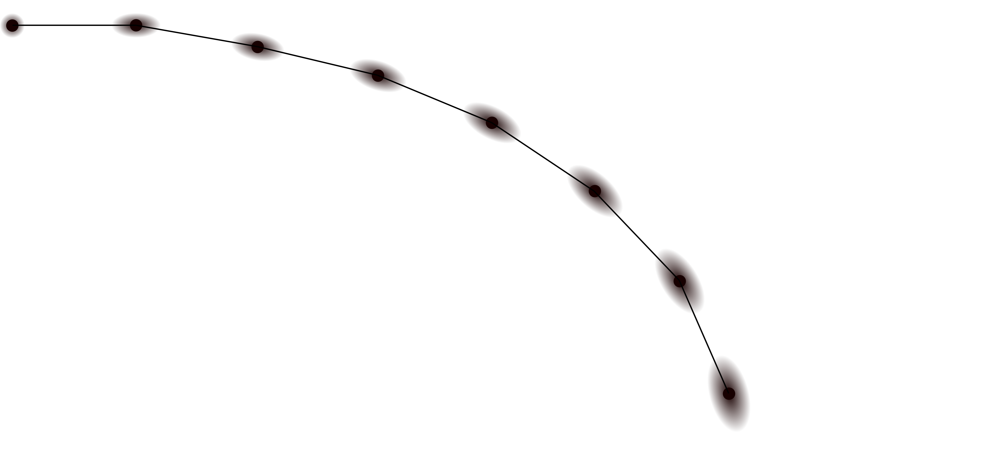
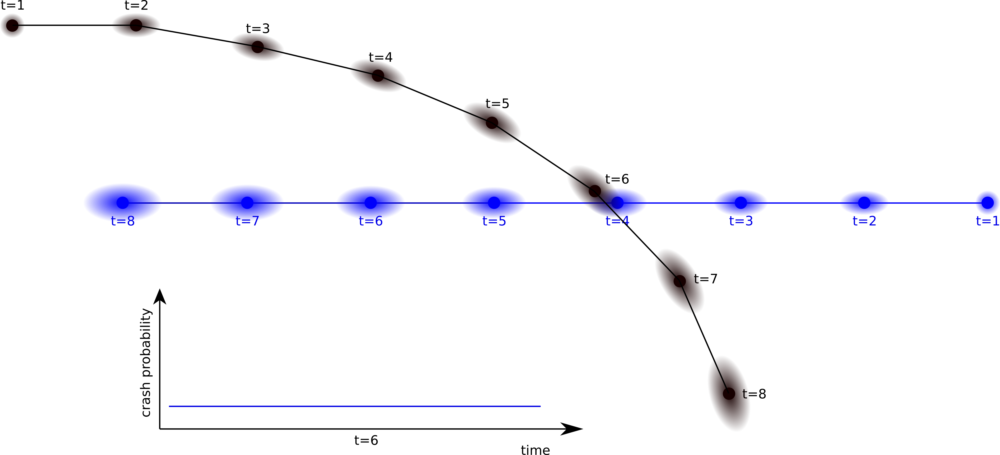
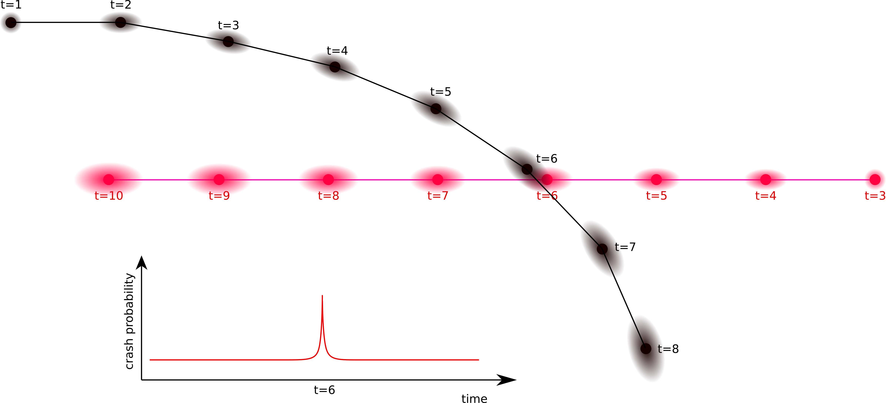

## Risk Estimation Step by Step

### Step 0: Trajectory
The risk computation is based on given trajectories of at least to entities.
Trajectories are defined as a list of positions with timestamps.
For convenience, there are functions that extend a single position and a velocity vector to a trajectory, assuming a linear constant motion.

Example trajectory:


### Step 1: Uncertain Trajectory
Since the future is inherently uncertain, so are future expected positions of entities.
Thus, the positions in the trajectory are uncertain as well.
The uncertainty increases with time, i.e. positions in far future are more uncertain than positions in the near future.
To accommodate for this uncertainty, all trajectories are transformed into uncertain trajectories.
Here the uncertainty is modulated depending on three aspects:
* uncertainty increases with time
* uncertainty increases with speed
* longitude uncertainty is larger than lateral uncertainty

Based on this the uncertainty is modelled with a 2D Gaussian distribution.
The variance in movement direction (longitudal) is computed from speed and timestamp.
The variance perpendicular to the movement direction is a fraction of the longitudal variance.

Example uncertain trajectory:


### Step 2: Crash Probability
For computing the probability of that at a certain point of time two different entities crash into each other, the 2D Gaussian distribution from that time have to be multiplied.
For two trajectories (from two different entities) this is done for each time step.

Crossing trajectories that pass due to shift in time:


Crossing trajectories that lead to a crash:


### Step 3: Risk Computation
In order to compute the risk, the crash probabilities are multiplied with a severity (how critical is a crash).
The overall risk of an entity crashing into another is the integration of the future risks over future time.

## Main functions overview

#### Step 0: Trajectory
```python
from risk_model import Trajectory

Trajectory.linear_prediction(...)
```

Create a linear trajectory from an entity position and velocity vector.

#### Step 1: Uncertain Trajectory
```python
from risk_model import Trajectory

trajectory = Trajectory.linear_prediction(...)
trajectory.uncertain()
```
Transforms a given a trajectory (list of positions and list of velocities) into an uncertain trajectory.
This is done by computing a Gaussian covariance matrix for each time step.
The covariances model the uncertainty and are based on the speed (high speed means higher variance/uncertainty).

#### Step 2: Crash Probability
```python
from risk_model.event_calculators.overlap_calculator import calculate_overlaps
```

Computes overlap of one trajectory with multiple other trajectories. This helps us generally to avoid unnecessary recomputation. The output is an array of array of collision probabilites (one collision probability for each timestamp between two trajectories for every combination of the single trajectory with one of the multiple ones).

#### Step 3: Risk Computation
```python
from risk_model import compute_survival
```
Does a [survival analysis](https://en.wikipedia.org/wiki/Survival_analysis)
based on `Event`s. One specific type of event is calculated in step 2 which is
are the collision events / collision probabilites. The survival analysis component here does work similarly to the
step 2 in that it also takes a list of Events for multiple trajectories (so a List[List[Event]]).

## Licenses

### Get dependency licenses

```bash
pip install pip-licenses # has to be in the venv
pip-licenses -f csv | awk -F, '{ print "| " $1 " | " $3 " |" }' | tr -d '"'
```

| Name            | License                                            |
| :-------------- | :------------------------------------------------- |
| Pillow          | Historical Permission Notice and Disclaimer (HPND) |
| contourpy       | BSD License                                        |
| cycler          | BSD License                                        |
| fonttools       | MIT License                                        |
| kiwisolver      | BSD License                                        |
| matplotlib      | Python Software Foundation License                 |
| numpy           | BSD License                                        |
| packaging       | Apache Software License; BSD License               |
| pyparsing       | MIT License                                        |
| python-dateutil | Apache Software License; BSD License               |
| six             | MIT License                                        |

## Literature

Tim Puphal, Malte Probst and Julian Eggert, "Probabilistic Uncertainty-Aware Risk Spot Detector for Naturalistic Driving", *IEEE Transactions on Intelligent Vehicles*, vol. 4, issue 3, pp. 406-415 , 2019 \
https://www.honda-ri.de/publications/publications/?pubid=4067

Julian Eggert and Tim Puphal, "Continuous Risk Measures for Driving Support", *JSAE International Journal of Automotive Engineering*, vol. 9, no. 3, pp. 130-137, 2018 \
https://www.honda-ri.de/publications/publications/?pubid=3752
